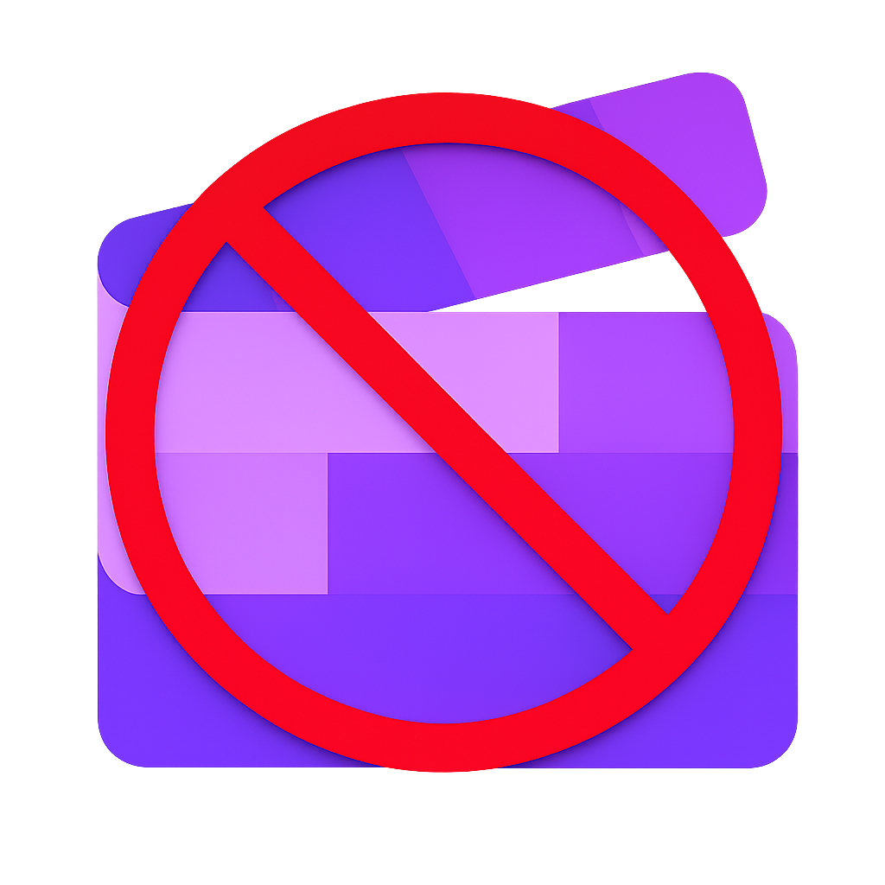
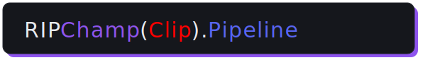
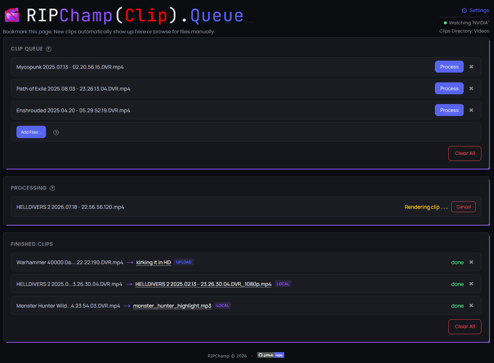
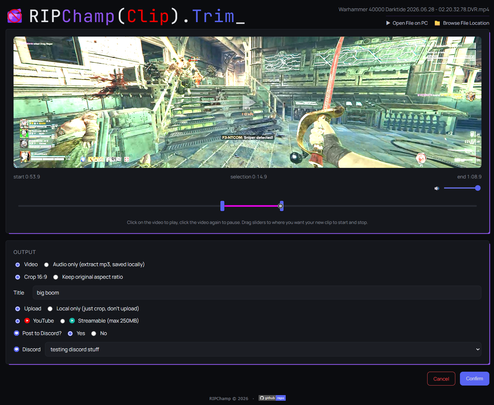
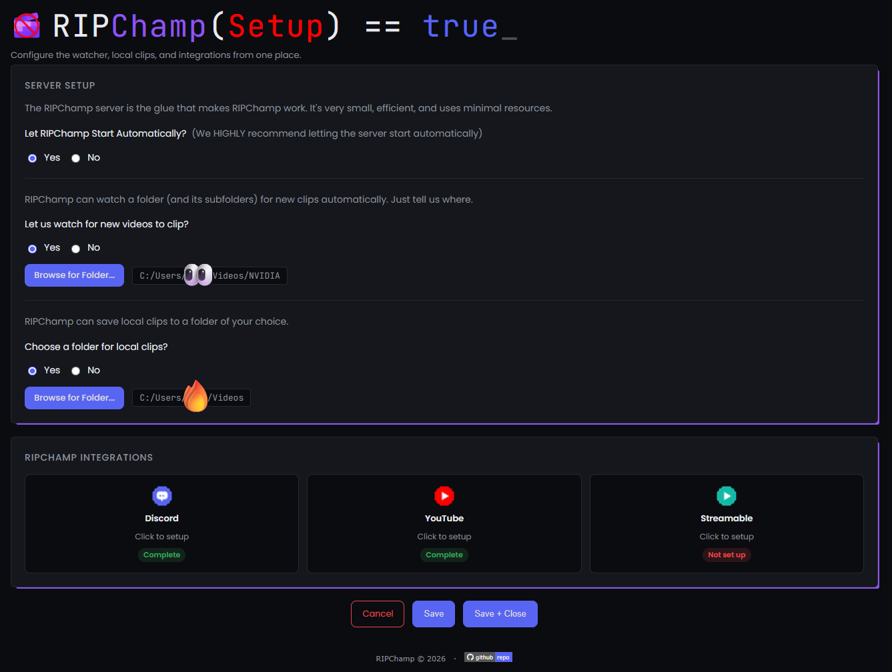
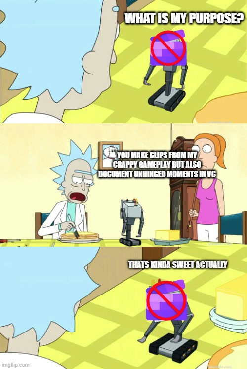

  

  

  A back-to-basics clip pipeline for people who just want to crop, trim, and ship a clip
  without the bullshit.

## Summary

RIPChamp watches folders you choose for new game/screen recordings and turns them into a
simple browser-based queue: pick a clip, trim it, choose whether it stays local or gets
uploaded, and let it run in the background while you get back to whatever you were doing.
No editor to open, no export dialog to fight, no drag-and-drop UI stealing focus mid-game.
Didn't come from a watched folder? Add it to the queue manually from the same page.

It started as a personal script and grew into something meant to be shared: a real
installer, a first-run setup page, and encrypted local storage for all credentials.

  
  
  

## Features

- **Folder watcher** — monitors one folder (and its subfolders) for new recordings and
  adds them to the queue automatically; nothing pops up or steals focus while you're
  mid-game.
- **Browser-based queue** — a bookmarkable page listing everything waiting to be
  processed, currently processing, and already finished. Process clips whenever you're
  ready, not the instant they finish recording.
- **Trim & crop picker** — scrub to set start/end, choose to crop to 16:9 or keep the
  source's original aspect ratio, and preview before committing.
- **Audio-only extraction** — pull just the audio out as an mp3, with a custom filename
  if you want one.
- **YouTube upload** — uploads as Unlisted by default, with its own setup flow (Google
  Cloud Console walkthrough, client secret ingestion via a native file picker, one-click
  OAuth authorization).
- **Streamable upload** — no account or setup needed; automatically compresses to fit
  the 250MB cap.
- **Discord integration** — posts a link (or the file directly) to a Discord channel via
  webhook after upload, with support for multiple named channels.
- **Encrypted credential storage** — Discord webhooks and the YouTube client
  secret/token are encrypted at rest with Windows DPAPI, tied to your Windows account.
  No plaintext secrets on disk.
- **First-run setup page** — configure start-at-login, the watch folder, the local clip
  folder, and every integration from one page, with live status badges showing what's
  configured.
- **Multi-file browse** — manually add one or many videos to the queue at once, for
  anything the watcher didn't catch automatically.
- **Standalone installer** — checks for Python/ffmpeg (offering a one-click winget
  install if missing), installs RIPChamp's own Python dependencies, and launches straight
  into first-run setup.
- **GPU-accelerated encoding** — auto-detects NVENC/QuickSync/AMF/VideoToolbox and falls
  back to CPU encoding if none are available.
- **HDR tone-mapping** — auto-detects HDR sources and tone-maps down to SDR instead of
  producing a washed-out flat image.

 

## Requirements

- Windows 10/11
- Python 3.10 or later*
- ffmpeg*
- A modern web browser

* The installer checks for Python and ffmpeg automatically, offering a one-click
winget install for either if they're missing, and installs RIPChamp's own Python package
dependencies for you.

## Open Source

RIPChamp is free and open source software, licensed under the GNU General Public License
v3.0. You're free to use it, study it, modify it, and share it with others under the same
terms.

## License

GPLv3 — see [COPYING](COPYING).
